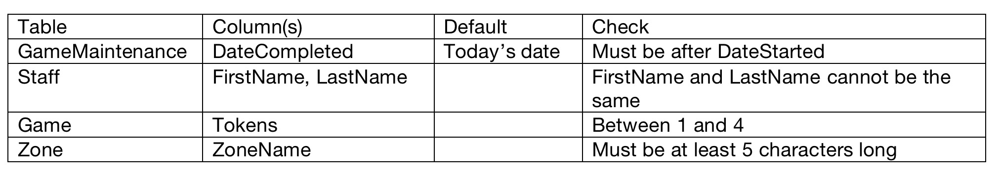
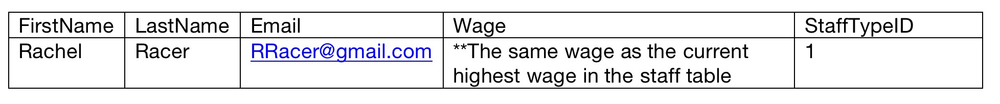
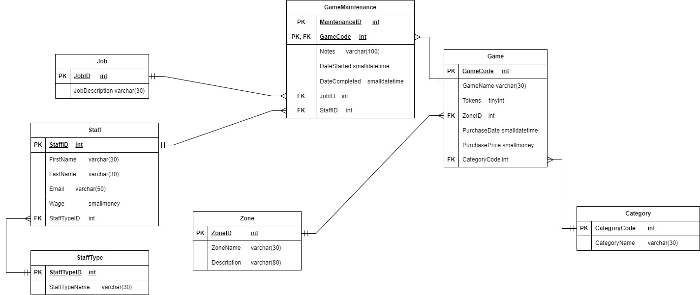

# Game Zone!

Game Zone is a bringing back the old school, with some new twists of course! The supplied ERD shows the database design that is currently in use to its operations.
File and submission requirements
The file Quiz2.sql contains statements to create the tables and insert test data and placeholders for each answer. You must answer all the questions on the Quiz2.sql file. When you are complete, upload your completed Quiz2.sql file to Moodle.  

## PART A - Constraints
Add the following constraints to the table definitions (DO NOT use alter table). 
HINT: Consider doing this question last so it does not interfere with the creation of the tables and the test data. 
(5 marks)

## PART B - Indexes
Create non clustered indexes on the foreign keys in game table. (1 mark)

## PART C – Alter Table
Assuming the tables have data in them already, use the alter table statement to add a new column defined as CategoryDescription varchar(100) that does not allow nulls. Any Categories that do not have a CategoryDescription should default to “None” (2 mark)

## PART D - Queries
Write the following queries:
1.Which games keep needing maintenance? Select the GameCode and GameName for all the games that have more than 4 GameMaintenance records. (3 marks) 

2.Select all the StaffID’s, Staff full names (as one column) and their StaffType names (2 marks) 

3.How many Games have been purchased each year? Select the Year and the count. Show the results in descending order by year (3 marks)
 
4.Select the game names that have not had any maintenance started on them in the current calendar year. Do not use a join. (3 marks)

5.Select the JobID, JobDescription and the count of how many times each job has been performed. (3 marks)

## PART E - DML
1.Add $1 to the wage of all the staff whose current wage is less than $15 . (2 marks)  

2.Delete all the categories that have no games. (2 marks)

3.Insert the following record into the Staff table. (2 marks)

## PART F - Views
1.Create a view called MaintenanceHistory that selects all the GameCodes, GameName, MaintenanceID’s, Notes, DateCompleted, and JobDescriptions for ALL games. (2 marks)	

2.Using the MaintenanceHistory view select the GameCodes, GameName and how many times maintenance has been performed on each game. (2 marks)

## ERD

